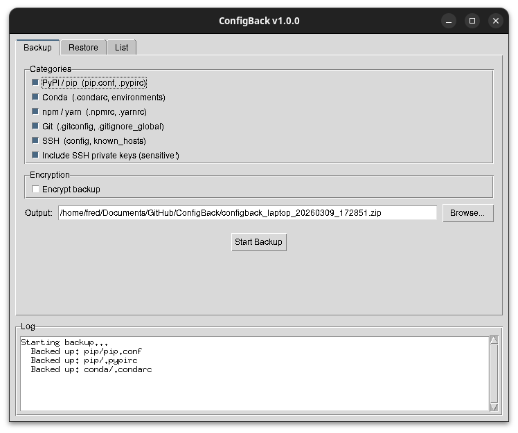
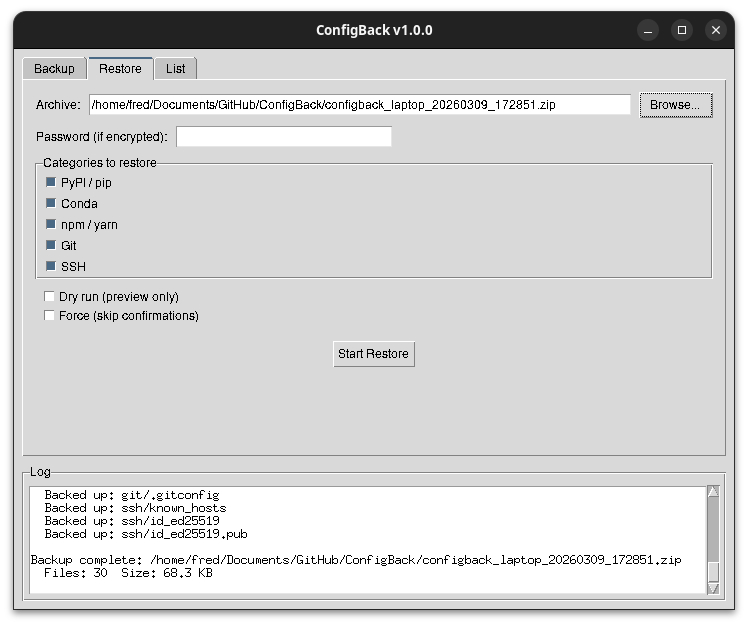

# ConfigBack

**Back up and restore developer configuration files across Linux, macOS, and Windows.**

ConfigBack is a single-file Python tool that helps you migrate developer environment configurations between machines. It supports backing up pip/PyPI settings, conda environments, npm/yarn configs, git settings, and SSH configurations into a single portable archive.

## Features

- **Cross-platform**: Works on Linux, macOS, and Windows
- **All-in-one archive**: ZIP-based backup with organized category structure
- **CLI + GUI**: Full command-line interface and tkinter-based graphical interface
- **Optional encryption**: AES encryption (Fernet) with PBKDF2 key derivation
- **Selective backup/restore**: Choose specific categories to include
- **Safe restore**: Existing files are backed up (`.bak`) before overwriting
- **Dry-run mode**: Preview restore operations without making changes
- **Conda environment export**: Automatically exports conda environment specs

## Supported Configurations

| Category | ID | Files |
|----------|----|-------|
| PyPI / pip | `pip` | `pip.conf` / `pip.ini`, `.pypirc` (tokens & credentials) |
| Conda | `conda` | `.condarc`, conda environment exports (YAML) |
| npm / yarn | `npm` | `.npmrc`, `.yarnrc`, `.yarnrc.yml` |
| Git | `git` | `.gitconfig`, `.gitignore_global` |
| SSH | `ssh` | `~/.ssh/config`, `~/.ssh/known_hosts`, private keys (opt-in) |

## Installation

```bash
# Basic installation
pip install configback

# With encryption support
pip install configback[encryption]
```

Or install from source:

```bash
git clone https://github.com/cycleuser/configback.git
cd configback
pip install .
```

## Quick Start

```bash
# Back up all configurations
configback backup

# Back up with encryption
configback backup --encrypt

# Back up specific categories only
configback backup -c pip,git,ssh

# List contents of a backup
configback list configback_myhost_20260306_143000.zip

# Restore from backup (dry-run first)
configback restore configback_myhost_20260306_143000.zip --dry-run

# Restore for real
configback restore configback_myhost_20260306_143000.zip

# Launch GUI
configback gui
```

## CLI Reference

### `configback backup`

Create a backup archive of configuration files.

| Argument | Description |
|----------|-------------|
| `-o`, `--output` | Output file path (default: `configback_{hostname}_{timestamp}.zip`) |
| `-e`, `--encrypt` | Encrypt the backup archive |
| `-p`, `--password` | Encryption password (interactive prompt if omitted) |
| `--include-keys` | Include SSH private keys in backup |
| `-c`, `--categories` | Comma-separated list: `pip,conda,npm,git,ssh` |

**Output**: A `.zip` file (or `.zip.enc` if encrypted) containing the selected configuration files and a `manifest.json` with metadata.

**Example**:
```bash
$ configback backup -c pip,git -o my_configs.zip
ConfigBack v1.0.0 - Backup
Categories: pip, git

  Backed up: pip/pip.conf
  Backed up: pip/.pypirc
  Backed up: git/.gitconfig
  Backed up: git/.gitignore_global

Backup complete: my_configs.zip
  Files: 4  Size: 2.3 KB

Success!
```

### `configback restore`

Restore configuration files from a backup archive.

| Argument | Description |
|----------|-------------|
| `FILE` | Path to backup archive (positional, required) |
| `-p`, `--password` | Decryption password (auto-detected if archive is encrypted) |
| `-c`, `--categories` | Comma-separated categories to restore |
| `--dry-run` | Show what would be restored without making changes |
| `--force` | Skip confirmations, force overwrite existing conda envs |

**Output**: Restores files to their platform-appropriate locations. Existing files are backed up with `.bak.{timestamp}` suffix before overwriting.

**Example**:
```bash
$ configback restore my_configs.zip --dry-run
ConfigBack v1.0.0 - Restore
[DRY-RUN MODE]

Archive from: linux (myworkstation)
Created: 2026-03-06T14:30:00+00:00
  [DRY-RUN] pip/pip.conf -> /home/user/.config/pip/pip.conf (exists)
  [DRY-RUN] pip/.pypirc -> /home/user/.pypirc (exists)
  [DRY-RUN] git/.gitconfig -> /home/user/.gitconfig (exists)

Done!
```

### `configback list`

Display the contents of a backup archive.

| Argument | Description |
|----------|-------------|
| `FILE` | Path to backup archive (positional, required) |
| `-p`, `--password` | Decryption password |

**Example**:
```bash
$ configback list my_configs.zip
ConfigBack Archive: my_configs.zip
  Version:   1.0.0
  Created:   2026-03-06T14:30:00+00:00
  Platform:  linux
  Hostname:  myworkstation
  Encrypted: False

  [Git]
    .gitconfig                                    1.2 KB
    .gitignore_global                             0.3 KB
  [PyPI / pip]
    pip.conf                                      0.2 KB
    .pypirc                                       0.5 KB

  Total: 4 files
```

### `configback gui`

Launch the graphical user interface.

The GUI provides three tabs:
- **Backup**: Select categories, set output path, optional encryption
- **Restore**: Browse for archive, select categories, dry-run option
- **List**: Browse and inspect archive contents in a tree view







### Global Options

| Argument | Description |
|----------|-------------|
| `--version` | Show version number |
| `-v`, `--verbose` | Enable verbose/debug output |

## Archive Format

The backup archive is a standard ZIP file with the following structure:

```
archive.zip
├── manifest.json
├── pip/
│   ├── pip.conf
│   └── .pypirc
├── conda/
│   ├── .condarc
│   └── envs/
│       ├── base.yml
│       └── myenv.yml
├── npm/
│   ├── .npmrc
│   └── .yarnrc
├── git/
│   ├── .gitconfig
│   └── .gitignore_global
└── ssh/
    ├── config
    └── known_hosts
```

The `manifest.json` contains:
- `configback_version`: Tool version that created the archive
- `timestamp`: Creation time (ISO 8601)
- `platform`: Source OS (`linux`, `darwin`, `win32`)
- `hostname`: Source machine name
- `encrypted`: Whether the archive was encrypted
- `categories`: Map of category -> list of archived file paths

## Encryption

When using `--encrypt`, the archive is encrypted using:
- **Algorithm**: AES-128-CBC (via Fernet)
- **Key derivation**: PBKDF2-HMAC-SHA256 with 480,000 iterations
- **Salt**: 16 bytes, randomly generated per archive

The encrypted file has a `CFGBAK01` magic header for auto-detection.

Requires the `cryptography` package:
```bash
pip install cryptography
```

## Cross-Platform Path Mapping

ConfigBack automatically maps configuration file paths between platforms:

| Config | Linux | macOS | Windows |
|--------|-------|-------|---------|
| pip config | `~/.config/pip/pip.conf` | `~/Library/Application Support/pip/pip.conf` | `%APPDATA%\pip\pip.ini` |
| .pypirc | `~/.pypirc` | `~/.pypirc` | `%USERPROFILE%\.pypirc` |
| .condarc | `~/.condarc` | `~/.condarc` | `%USERPROFILE%\.condarc` |
| .npmrc | `~/.npmrc` | `~/.npmrc` | `%USERPROFILE%\.npmrc` |
| .gitconfig | `~/.gitconfig` | `~/.gitconfig` | `%USERPROFILE%\.gitconfig` |
| SSH config | `~/.ssh/config` | `~/.ssh/config` | `%USERPROFILE%\.ssh\config` |

## Security Notes

- **SSH private keys** are excluded by default. Use `--include-keys` explicitly.
- Encrypted archives use strong key derivation (PBKDF2, 480k iterations).
- Avoid passing passwords via `--password` on shared systems (visible in process list). Use the interactive prompt instead.
- The `.pypirc` file may contain PyPI upload tokens. Handle backups accordingly.

## Publishing to PyPI

Upload scripts are included:

```bash
# Linux / macOS
./upload_pypi.sh

# Windows
upload_pypi.bat

# Upload to TestPyPI first
./upload_pypi.sh --test
```

## License

MIT License. See [LICENSE](LICENSE) for details.
